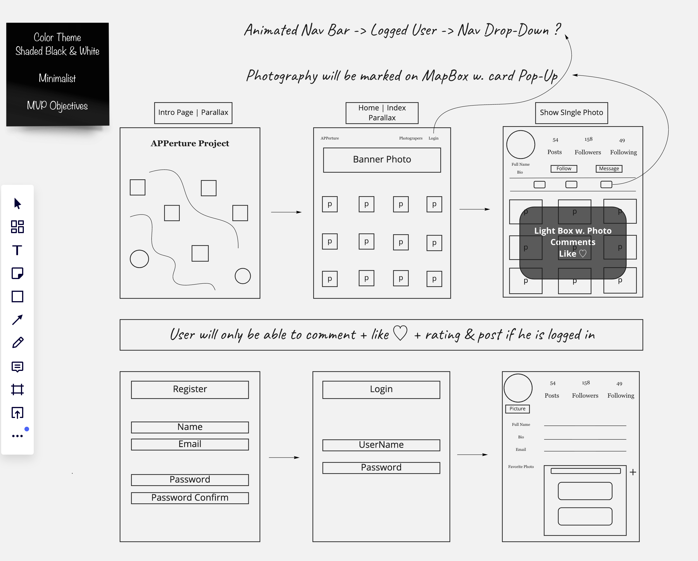
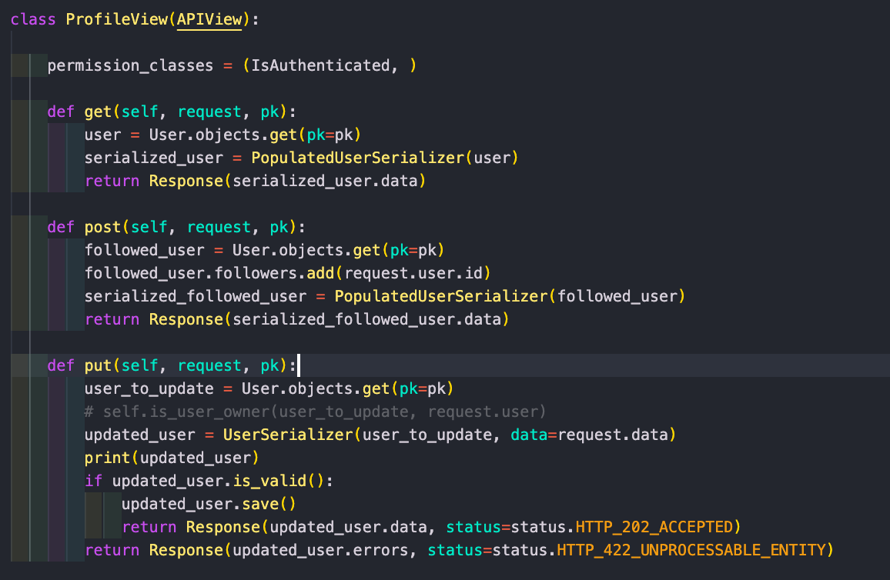
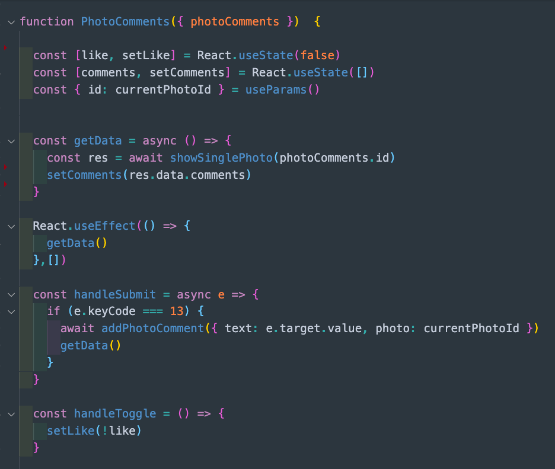
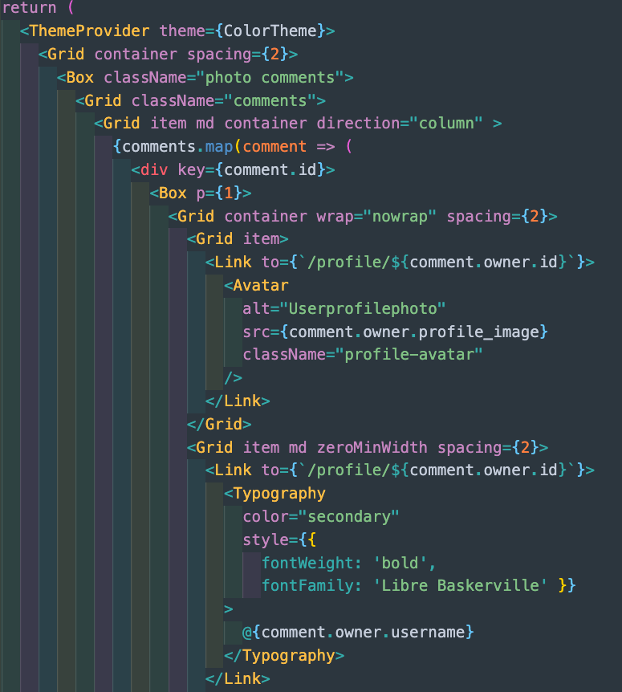

# General Assembly SEI-49 | Project 4 - APPerture :camera:

Parallax feature and sign in behavior.
 

Profile features.

## :mag: Technical brief

- **Build a full-stack application** by making your own Backend and Frontend.
- **Use a Python Django API** using Django REST Framework to serve your data from a Postgres database.
- **Consume your API with a separate Frontend** built with React.
- **Submit a complete app** with multiple relationships and CRUD functionalities.
- **Implement thoughtful user diagrams/wireframes** that help plan which features are core MVP.
- **Deploy your app online.** Make it publicly accessible.
- **React Hooks** is optional for this project.
- **Time Frame**: 7 days.
- **Optional:** Choice of doing it individual or in a group.

---

## :floppy_disk: Technologies:

- HTML5
- SCSS & Bootstrap
- Material UI
- React Spring (Parallax)
- DjangoDB REST Framework
- Python
- ReactJS
- JavaScript (ES6)
- Insomnia
- TablePlus
- Quick Database Diagrams
- Miroå
- Trello Board

---

## :trident: Overview

- The App is hosted [here](http://apperture-project.herokuapp.com/)
- Else, kindly clone or fork the repository:
  _ To install all the packages listed in the package.json: —> `npm i`  
   _ Navigate into the shell -> `pipenv shell`
  _ Run the app on localhost:8000 : —> `python manage.py runserver `
  _ Check the console for any issues and if there are any then check the `package.json` for any dependancies missing —>  
   _ Navigate to [http://localhost:8000/](http://localhost:8000/)
  _ Open the frontend `code frontend` in your terminal \* Type `npm i` in your terminal to dl dependencies then `npm start`
   
   

---

## :writing_hand: Process

**We chose to work in a pair** because our previous project raised the difficulties to work in group which is a point we wanted to be prepared for. Therefore, we decided to expose ourselves to the market reality and the collaboration requirements. Subsequently, the planning and attribution of tasks were essential to us which allowed to keep this project objectives clear.

We decided to **pair code directly through VSCode live share while being on Zoom every day** to be exposed to today’s market working methods. Doing so **enhanced our ability to communicate through the various daily objectives or issues encountered** while working on separated components which was incredibly efficient.

This working method allowed us to **test & validate our codes**, therefore confirmed our ideas  instantly which optimised our productivity.

Instead of debugging any pushed commits on the development branch that would trigger merging conflicts, we were resolving them as we were testing our components.

---

 

**The project idea rapidly took form** as we both had a similar vision on the final render & UX.  
With no previous experience or knowledge on the concept, we decided to use **React-Spring** to render some **parallax** effects! Factorising it to our project was such a challenge but we firmly believe that this pain took our idea to the next level. Our appreciation for photography was the starting point of our brain storming and led to us to revisit a market reference App: Instagram. Excited by some of its functionalities, we decided to challenge ourselves and work our project around them.
 

 

Establishing the Relationship Diagram & setting up our Backend accordingly was the very first obstacle.
 

 

The logic related to the ‘Following - Follower’ gave us a hard time! With some help, we came up with a solution that made this challenge mentally rewarding.

 

 

---

 

**ReactJS gave us food for thoughts** as we wanted to use another technology than Bulma (previous project).
 
Intrigued by the **substantial functionalities and the documentation of Material UI**, we had to allocate some time to verify that our current knowledge would allow us to implement it. **Material UI requires React Hooks which was only optional in our brief**. Our decision was risky but the **learning curve is what mattered most to us**, therefore we settled on Material UI along with React Hooks.

 

---

## :weight_lifting_man: Challenges

- After only a **week and a half of learning both Python and Django**, we felt this was the most important part of the project. We spent the most time figuring out the backend as we really wanted to do this right.

- The tables and relationships was also another tricky idea to code and implement.

---

## :collision: Highlights

- Using **Material UI** which forced us to implement React Hooks was an **incredible challenge**, but a successful one.

- The use of **Parallax** on our homepage as well as the content view made a powerful impact. Again, something which was **hard to implement** but one which was very rewarding.

- As we worked on previous 48 hour project together **we weren't the strongest at styling or CSS**. That project was six weeks prior to this, and **this showcases how much we have both progressed with our learning, understanding and implementing of code.**

## :high_brightness: Used Resources

[Unsplash](https://unsplash.com/)  
[Alan Shaller](http://alanschaller.com/)  
[Instagram](https://www.instagram.com/)  
